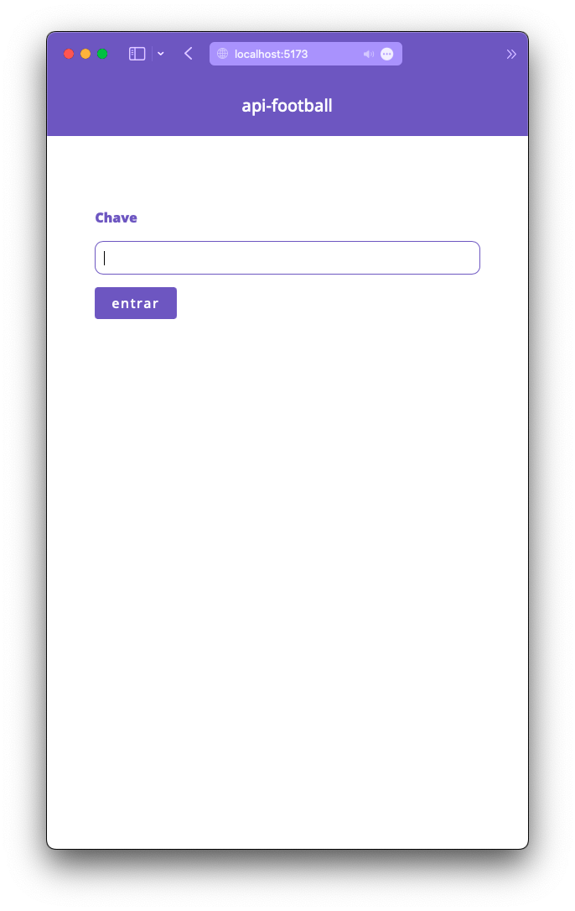
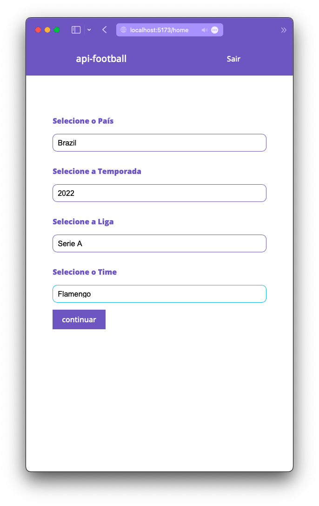
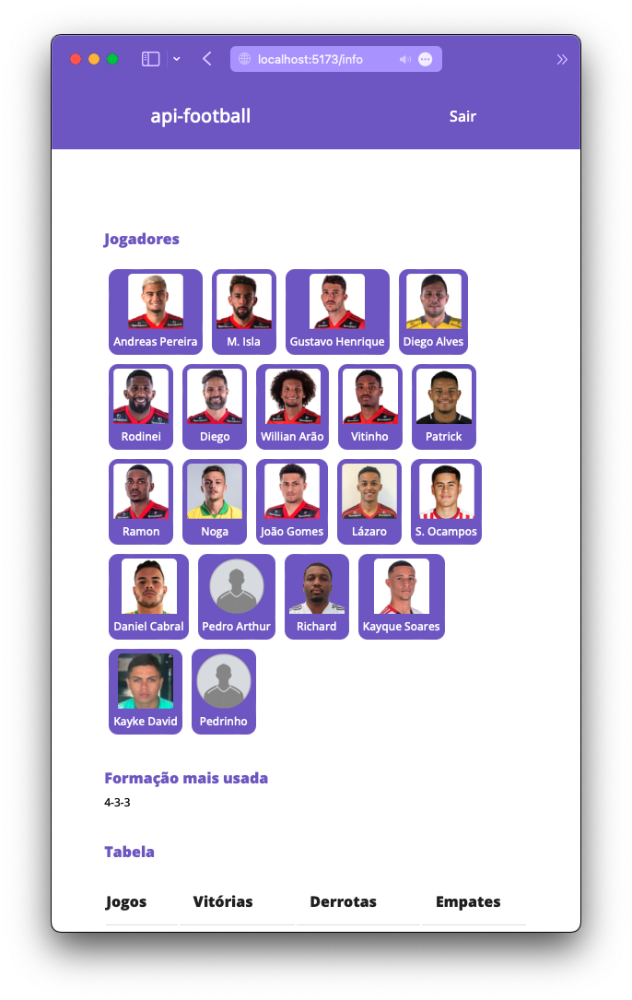

# Teste técnico trade

Teste prático para a vaga de desenvolvedor front-end

## Apêndice

- telas
- Pontos Desenvolvidos
- impedimentos
- Rotas
- Rodar a Aplicação

### Telas





## Pontos Desenvolvidos

Os pontos desenvolvidos foram para consumir a api seguindo todas as orientações fornecidas pelo documento base.

Foi possível resumir a aplicação em 3 telas.

### Impedimentos

Existem, por diversas vezes, dados incompletos como os de gráfico e tabela que pode acontecer de algumas vezes esses dados não são renderizados na tela.

Outro ponto negativo foi encontrar a chave e assimilar as informações fornecidas pela api.

### Rotas

As rotas são

| Rota    | Função                                                                                   |
| ------- | ---------------------------------------------------------------------------------------- |
| "/"     | tela de login caso o usuário não esteja logado ou a tela home caso o mesmo esteja logado |
| "/info" | tela que centraliza todas as informações e exibe na tela os endpoints pedidos            |

### Rodar a Aplicação

Para rodar a aplicação deverá usar o comando:

```bash
npm run dev
```

```bash
yarn dev
```

#### build

O projeto poderá ser buildado usando o seguinte comando

```bash
npm run build
```

```bash
yarn build
```
